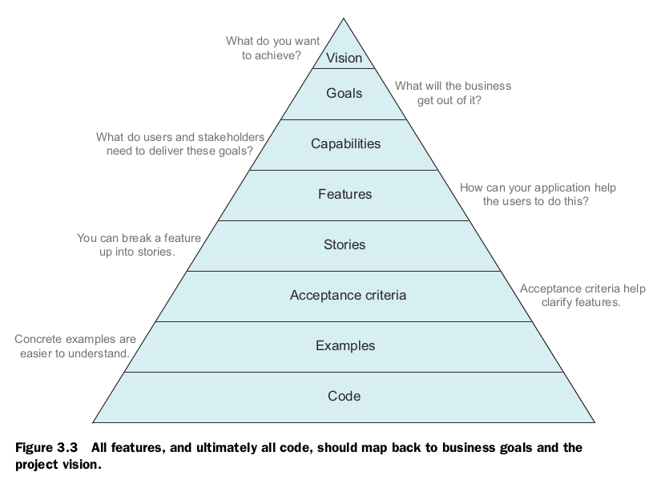
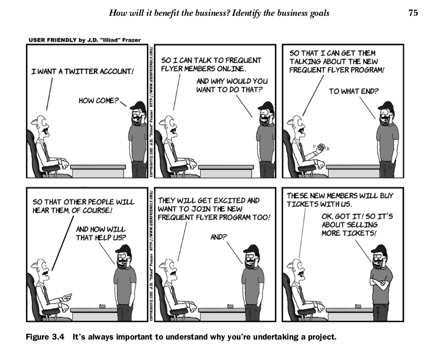
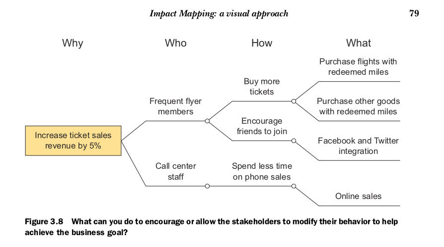
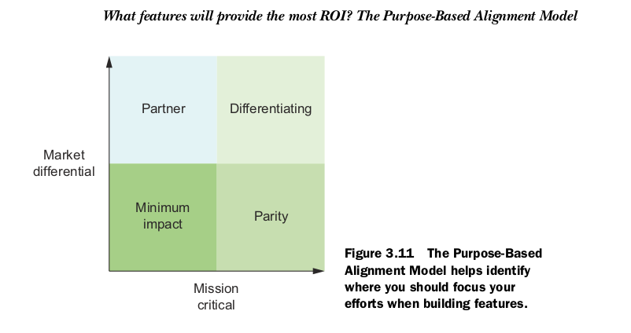

## 使用 BDD 定义需求

### Chapter 3

我们学到如何通过 BDD 来评判一个 Feature 的价值，从而确定要做什么，更重要的不做什么，这是做一个正确的软件的核心。

要对一个问题深入了解，最好的方法莫过于提问题了吧。我们在进行一个软件的设计之前，首先要做的就是要去了解真正的需求，而这个真正的需求往往并不容易找到，所以需要以下四个问题：

1. 为什么要开发这个软件？(愿景)
2. 这个软件能给公司带来什么价值？（业务目标）
3. 这个项目的利益相关者都是谁，这个项目如何影响他们？
4. 这个软件要为利益相关者提供什么功能才能有效的实现他们的业务目标？

三项技术可以用来分析以上问题：

Feature Injection： 帮助找出那些可以满足业务目标的 Feature 。  
Impact Mapping： 可视化 业务目标， 利息相关者 和 Feature 的关系。  
Purpose-Based Alignment Model： 帮助评估每个 Feature 需要的投入。  

下面分别说明这三个技术：

#### Feature Injection

它提供了一个框架来让 BDD 聚焦在那些提供真正的业务价值的 Feature 上. 它强调与利益相关者的不断的沟通从而彻底明白我们到底想要做什么并且还要知道为什么。分以下三步：

1. 捕获价值  
    首先我们需要清晰的获知这个系统的业务价值，然后找出能传达出业务价值的Feature，结下来我们就可以聚焦在这些Feature上，这就是捕获价值，实际上是基于价值找到核心的 Feature
2. 注入 Feature  
    价值来自输出，而不是输入。所以，要通过要获得的输出来去反推对应的 Feature。这里注入的意思类似与依赖注入的意思，实际是反向依赖的意思，正常是输出依赖 Feature， 现在是通过输出反推要做那些 Feature。
3. 找出示例  
    以上我们得到的 Feature 描述很片面，为了加深理解，需要更多的影响输出的输入和行为。示例对我们都更容易理解，能够扫除假设和误解。

以下是一场图，说明了不同层次的需求：

1. 愿景

是高层的目标，要简短凝练，能够凝聚力量，指引方向

在《Crossing the Chasm: Marketing and Selling High-Tech Products to Mainstream Customers》一书中，总结了一个表达愿景的模板：

>对于 <目标用户>  
他们 <有什么需求>  
我们的这个产品 <名称> 属于 <什么类型>什么类类型型  
不像 <其他的竟品>  
我们的这个产品 <有什么不同>

例如：

对于 学生，上班族  
他们 出于某些目的学英语  
我们的这个产品 学英语 是一款 移动应用  
不像 流利说呀，新东方呀  
我们的这个产品 可以随时随地的学习， 还能的分析给出及时的反馈，用户的每一个学习都会有记录并且还有根据评估制定出学习方案，系统的学习。

再例如：

对于 学生，上班族
他们 想分享自己的学习，兴趣，等等其他视频
我们的这个产品 社区 是一款 社区应用
不像 贴吧，优酷
我们 会对用户的上传进行严格审核，我们想方设法鼓励用户投稿，参加活动，鼓励互动

2. 降低一层，业务目标

业务目标的描述也会有特定的格式：

> 为了什么目标  
作为某某某  
我要做什么  

例如：

> 为了在半年内实现用户翻倍  
作为 社区的管理者  
我要鼓励用户去拉亲朋好友来  

一个好的业务目标应该具有一些特征：

* 具体： 不仅要让读者知道做什么，还要知道为什么，出于什么利益考虑
* 可测量： 这有利于表达期望达到的目标，方便判断是否完成，一般可以通过时间和数量来实现可测量比如：半年时间，实现用户的翻倍
* 可实现：
* 相关：这应该最重要的，要基于当前的情况，比如以上的用户翻倍，是基于有了一定的用户量了
* 时间限制

业务目标可以有多个，基本上可以分为以下四类：

* 增加收入
* 减少支出
* 保护收入
* 避免未来的支出

非营利的组织呢，业务目标分为：

* 提高服务
* 减少支出
* 减少未来支出

不断的问why来挖掘商业目的

无论是业务负责人还是用户，他们都不能表达他们的需求，他们只是说出他们具体的方案来，或者想要的功能来。这时候就需要对他们的需求进行拷问，找到深层的需求，然后再讨论他是否是最佳方案。  

这里用到了《你的灯还亮着吗》

#### Impact Mapping： 一种可视化方式

Impact Mapping 将 业务目标， 牵扯到的人员， Feature 的关联可视化了， 如图：

通过不断的问问题（Why， Who， How， What），使用思维导图，来发散，并且具体化

它是一个工具，可以在这里深入学习：
[Impact Mapping website](http://impactmapping.org)

或者看书： Impact Mapping by Gojko Adzic

谁会收益？找出利益相关者和他们的需求

所有项目都是要让组织受益，组织是由人组成的，所以需要这出他们从他们开始。

这些利益相关这包括，使用产品的用户，包括项目管理这等等，还包括间接相关的人，维护系统的人等等。

一旦找到了利益相关者，理解了他们的需求，就可以考虑项目要具备什么功能来满足他们了。

功能点（capability） 是高层的概念，不是实现，它们具有选择不同实现的灵活性。

#### 哪个 Feature 将会提供最大的 ROI？ 用 Purpose-Based Alignment Model 找出它来

是一个二维相限， 横轴是业务上的重要性， 纵轴是与竞品的不同

### Chapter 4， 我们学到如何通过 BDD 来描述一个 Feature 的细节，这里需要沟通，通过举例子。
### Chapter 5， 如何形式化的描述一个例子，从而消除歧义并可以用于自动化。
### Chapter 6， 介绍工具，自动化

