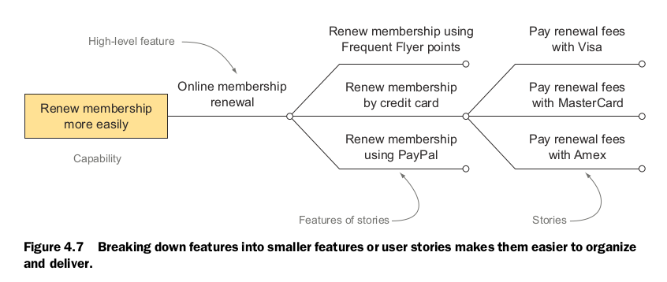

## chapter 4

这一章要来学习如何通过 Feature 提供软件的功能， 会学习一些用来描述和讨论 Feature 的技术。

1. feature 是帮助用户或其他利益相关者来实现业务目标的软件功能。feature 不是 user story， 但是可以被多个 user story 描述。

2. user story 将 feature 分解成更可管理的部分，从而更容易实现，表达

3. BDD 实践者通过 concrete example 来实现对一个 feature 达成共识。这些用例可以避免歧义和不确定性。

4. 管理不确定性在 BDD 实践中举足轻重。有经验的实践者会尽量避免太早明确定义方案，会保持开放选项，直到了解的足够多了才会提交当前最合适的方案。这叫做 Real Options。

5. Deliberate Discovery 通过管理不确定性和忽略来降低项目风险

6. 这些用例作为 automated acceptance criteria， 指导开发者实现功能，从而驱动开发进程。

### 什么是 feature？

在敏捷项目中， 开发者用了很多词来描述他们想要构建的东西。比如 Epics， capabilities, themes, requirements, features, use cases, user stories。 尽管这些词出来好久了，但也没有明确定义，很多团队还会为此辩论。

我们真正想要的是能够描述我们认为的用户的需求。我们像以一种用户能够理解的方式表达我们自己， 以便于他们可以尽早检验我们的理解，提供帮助，提供反馈。

我们使用的词应该能简化我们对用户需求的讨论：

1. 定期交付有形的，可见的业务价值
2. 获取反馈，一边我们走在正确的方向上

这些不同的词，都是在不同的层次将上层需求分解到可管理的大小， 使用那些词依赖与你的项目的大小和复杂性。下面介绍词：

* Capabilities 是提供给用户某种能力让他们能实现某种业务目标，或者执行某个有用的任务。不依赖特定的实现。比如“用户可以使用它添加滤镜”。

* Features 是一种软件功能， 牵扯到实现了， 比如： 在拍摄的时候添加滤镜。

* 当交付 Features， 你可以使用 user stories 分解它， 从而更好管理，更好计划和组织工作。

* 可以使用 examples 来理解 Features 是如何帮助用户的， 引导 user stoies 的工作。

#### Features 交付 Capabilities

用户更我们要功能，我们最终交付给他的是实现了某种功能的软件。

Feature 可以被相对独立的交付，不依赖其他的 Feature，可以被用户单独测试。Feature 可以被用来对某一个发布要包含什么做计划，或者写文档。

Feature 使用业务术语， 如果写用户手册，就会有 Feature 的介绍。

下面来距离说明一下描述 Feature 的格式的重要性。

> Feature: 线上会员续费  
In order to 更容易的续费我的会员  
As a 这个公司的会员  
I want to 在线续费会员  

简短的一个标题， 避免具体实现。在排期，设计，实现之前，都可以只使用这个标题。

在需要具体的时候，就可以使用上面的格式。  
目标是为了提醒你为什么它是必要的，是为了实现某个 capability。帮助我们检查这个 Feature 是否真的有必要。可以问自己一下问题：

1. 这个 feature 真的能实现这个业务目标？
2. 如果不能，那它实现什么目标？
3. 基于我现在所知，它是否还有必要？

下一步， 标出这个 Feature 会影响的用户， 以它的视角来检视这个 feature。

最后，描述具体做什么，这时候，还不需要与具体技术实现关联。

有时候，不是从用户的角度看这个 Feature, 而是从利益相关者，比如同样是上面的 Feature， 可以这样：

> Feature: 线上会员续费  
In order to 减少用户流失带来的销售额下降 
As a 这个公司的销售主管 
I want to 在线续费会员  

这里很有趣， 换成从利益相关者的角度看着 Feature， 立马视野开阔了， 可能不必非得这个 Feature 还有其他更好的方式

另外， 还可以有其他的描述形式：

> Feature: 线上会员续费  
As a 这个公司的会员  
I want to 在线续费会员
So that 更容易的续费我的会员  

最后要说的时候， 没有什么标准的形式， 团队，项目里有统一的形式的好了。（开且不同的形式可能会有不同的关注点，用多种方式探究也不错吧--译者注）

#### Feature 可以分解成可以更容易管理的块

Feature 有时后可能还太大，可能一个迭代里都实现不，所以需要按功能分解成更小的块。这些块叫做 “user stories”。如下图，在分解的时候可能要经过多层分解：

分解 Feature 有两种策略。一种如上，把一个把一个业务流程分成小的具体一点的业务流程但是不牵扯实现。

另一种是分解成这个业务流程包括那些步，如下：

这是危险的，过早的把具体的步骤，可能不是最适合的方案。

#### Feature 可以分解成更多的 user stories

user stories 也会将实现细节推迟，等到掌握更多信息时再谈实现

#### Feature 不是 user story

* Feature 是交付给用户或利益相关者的，为了提供某种能力来实现业务目标

* User Story 是一个计划工具，帮助你为 feature 提供更多细节

Feature 可以在比较的时候写，但是 User Story 可以在邻近实现的时候写。

#### Epics 实际就是很大的 user story， 需要在分，本书不讨论

#### 总有例外不是和这个层级结构

### 用 examples 实例化 features

Examples 是 BDD 的核心。在和用户或利益相关者交流时，开发者使用 examples 来加深对 Feature 的理解。扫除不确定性。

根据 David Kolb 的”基于实验的学习“理论， 有效的学习包含四个步骤：

书里通过一个例子，通过不断跟一个安全专家询问不同的密码是否安全，最后确定需求  

感觉没讲清楚呀

### Real Options：  

这是由 Chris Matts 提出， 它的意思是推迟决定，直到最后责任期。

Option 在经济领域有期权的意思， 之前了解过一点期货，现在发现，一点都没了解。

Option 给了你一种可能性， 可以以现在的价格去买未来某个时间的商品，也可以不买。

举个例子， 想象你在未来的三个月里很可能会用到大量的铁， 铁的价格在升高。你不想现在买，因为你不是完全确定，预期三个月后才确定。但是如果再等几个月，铁的价格就涨上去了。为了解决这个困境，你可以以今天的价格购买一个期权来在未来三个月后购买铁。如果铁的价格张了，到时候仍然可以以今天的价格买了。如果价格跌了，或者不需要了，可以选择不是用这个期权。你需要为这个期权付钱，但是只是这些铁的总价的一部分： 这是值得的， 因为它让你直到你确认需要它时才决定是否购买。（这是期权的意义，但是之前了解的时候这个都没有了解到，只以为它就是人们炒钱的东西，当然可能大部分都是为了炒钱吧）

生活中也有这个原则的例子。比如你想买个两个月后的机票， 但是你不确定能不能去，这时候一个 600 的票不能退，另一个700的票可以退， 这时候如果自己取得概率是 50%，那就要买那个贵的，这样多花了 100， 如果去，那就的确多花了 100， 如果不去， 都退， 那就相当于少损失 600。

Real Options 是对这个原理的应用。 Chris 总结了这个原理：

1. 选项有价值
2. 选项会过期
3. 在知道为什么了再做决定行动

下面详细来说明

#### 选项有价值

选项是有价值的，因为它们允许你推迟做决定，直到了解的足够多了在决定，这时候成功的概率就更高了。在金融业，股权的价值可以被精确的计算，但是在软件领域，是不可能的。但是，通常你对一个特定的问题直到的可选项越少，保持的你的选项开放就越有价值。

比如， 你为一个年轻的创业公司制作网站。它们不知道它们的用户体量会是多大。他们直到一开始可能很小，但是它们期望一年后会有数百万用户。

你有三个选择：

* 没有扩展性， 这样，如果达到了百万用户，应用个的架构就需要重构，会是个很大的花费
* 创建可扩展性， 但是如果体量上不去，就有点浪费了
* 你不去立刻实现一个完全可扩展的架构，但可以在一开始的时候花点时间考虑可扩展性。如果以后不需要扩展，则只浪费了一点调研的时间，如果需要扩展，则可能花更少的费用实现扩展。

#### 选项会过期

有交付日期，肯定会有过期， 实现功能是需要时间的， 比如 A 需要 5 天， B 需要 3 天， 如果离交付还有 4 天， 那 A 这个选项就不是个选项了。

####  在知道为什么了再做决定行动

推迟，并不是推迟到截止日期， 而是说当你了解了足够的信息再做决定， 比如两个同样功能的库， 要对每个做调研，了解清楚了再决定选择哪一个。

### Deliberate Discovery

在开发中， 最大的一个风险就是忽视， 所以在开始之前一定要做深入调研，广泛调研，避免忽视一些高效的方法。

Real Options 帮助你保持选项开放，直到掌握了足够的信息。Deliberate Discovery则帮助你获取这些信息。

### 从 examples 到应用： 预览一下

## 总结

BDD 的主要优势在于：

1. 对业务的交流沟通
2. 使用用例去驱除假设，构造对问题空间的统一理解。

