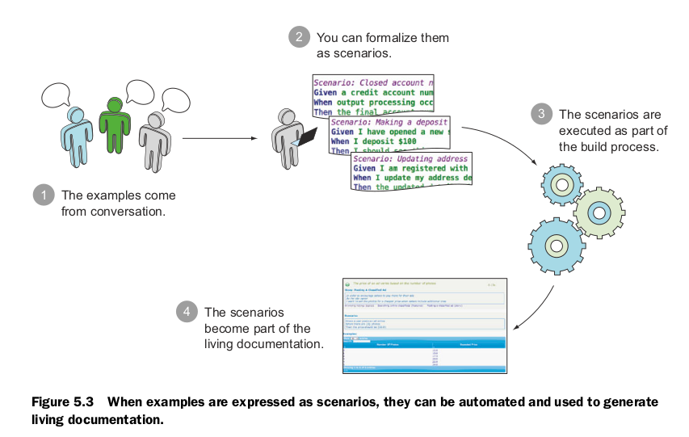
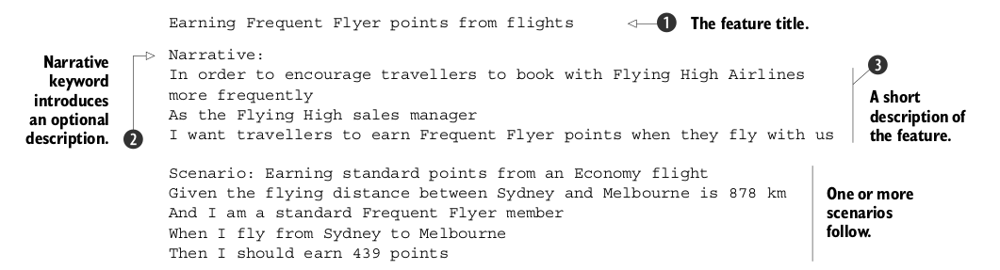
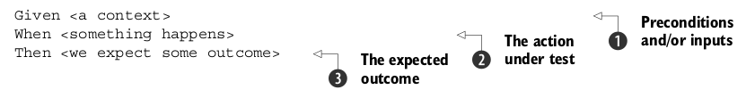
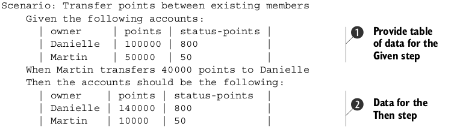
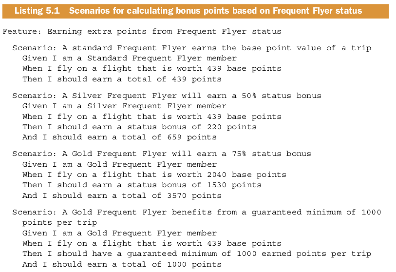
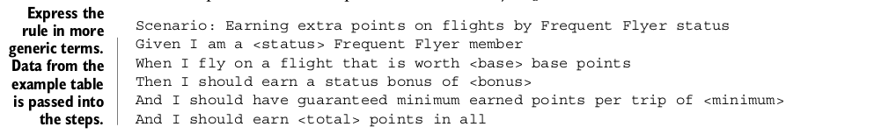
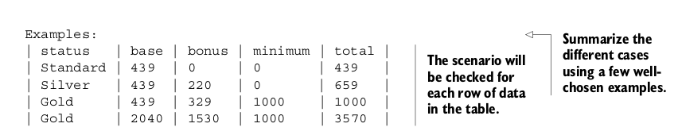
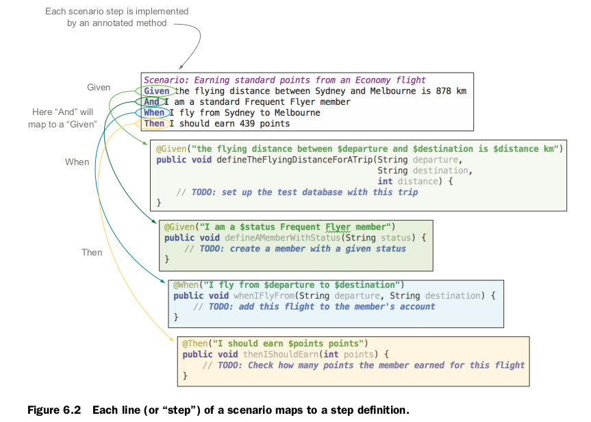
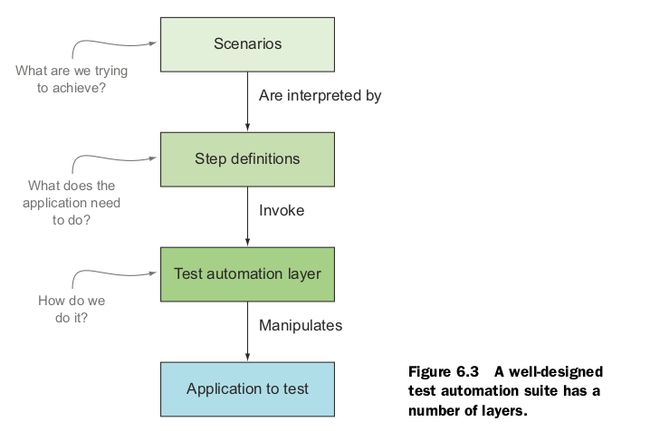

# Chapter 5 从 examples 到 可执行的 specifications

## 把具体的用例编程可执行的 scenario

有一些可以自动执行 Specifications 的软件如 JBehave， Cucumber 等等

下面是一个 Feature 文件：

一个 Feature 文件包含了一些 Scenario

Scenario 的标题简短凝练， 强调与其他 Scenario 的不同， 它们同在一个 Feature 里共享相同的上下文。

## Scenario 使用特定的结构，使用特定的关键字

Given 后面的 context 设置了一个舞台， 描述了测试的前提条件， 安装好测试数据， 让应用进入正确的测试状态。有时候只是提供一个说明，没有实际操作。

必须注意的是， 之包含那些与该测试直接相关的先决条件，不然会造成难以理解。

When 后面的是一些要测试的行为事件， 它们会产生输出， 在 Then 里面检验

除了以上基本的关键字， 还有 and 和 but， 让结构更清晰

还可以使用 # 加注释， 也可能使用 ！-- 引导注释

## 使用表格消除重复

消除重复的一个很牛的方式就是使用查表法来复用一条流程

从这样的重复

到这样的查表法

## Background 关键字 提供 Scenarios 功用的前提条件

# Chapter 5 自动化执行 Scenarios

这一章牵扯到具体的实现的使用， 这里不做说明， 因为关于库的使用最好的地方是官方文档。这里只说一些原理性的东西。

一个 Scenario 里包括很多步， 它们会被转化成对应的方法。

这样做的原因是为了避免重复， 实现了文本到代码的转化。也保持了一致性， 一旦修改了某个 Scenario 的某一步， 导致了文本和代码的不一致， 这个 Scenario 就会变为 pending 状态。

