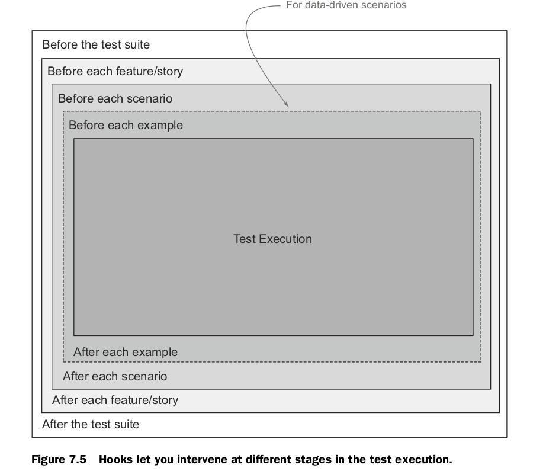
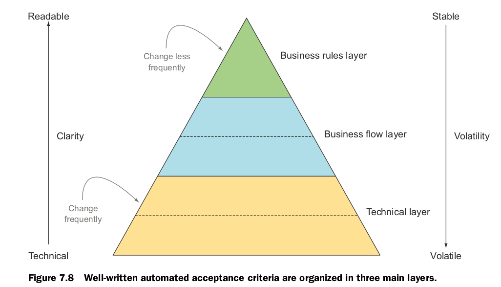
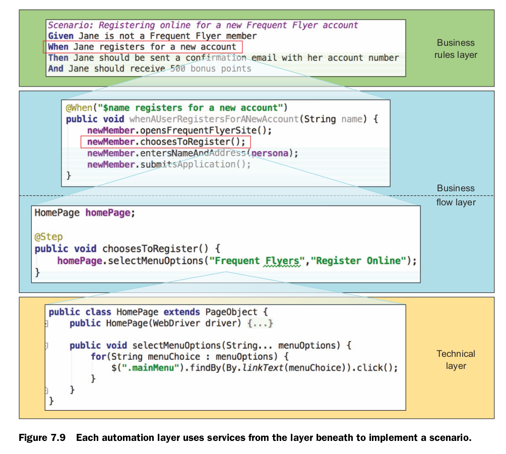
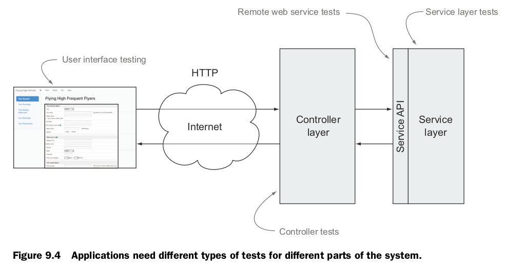
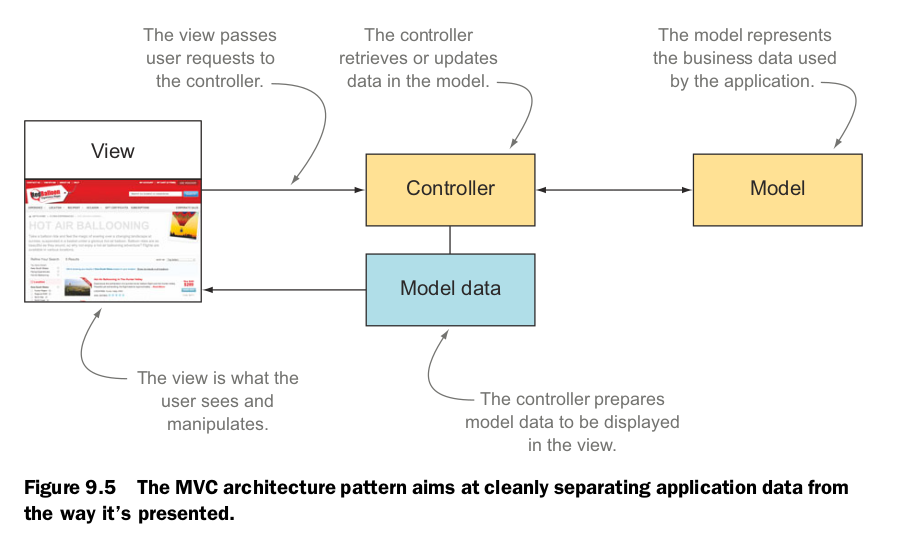
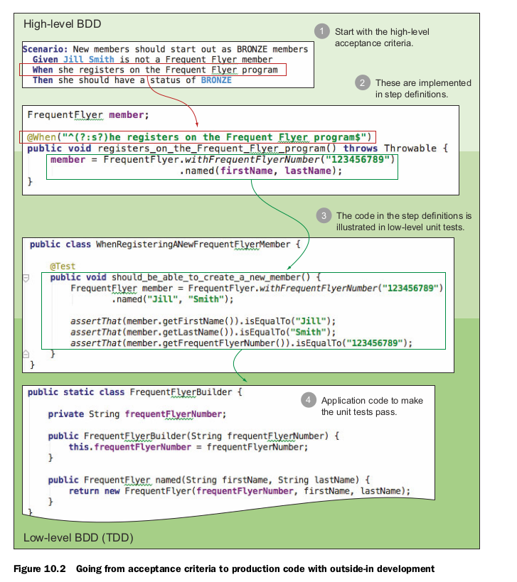

第三部分才开始讲编程写代码， 我好兴奋呀！！

# Chapter7 验收测试

好的验收测试需要遵循一下规则：

1. 首先应该是沟通工具  
2. 提供有效的反馈  
3. 值得信赖， 如果成功了，表示系统是正确的
3. 用以维护

## 自动化安装过程

一些策略：

1. 在每个测试前都要初始化数据库  
2. 如果，再每个测试之前初始化数据太耗时，可以再每个测试集合之前初始化数据库  
3. 使用测试 Hook  

4. 再 Scenario 里使用特定的数据，而不是去读数据库  
5. 使用角色， 比如使用具体的某个人 John， 初始化他的信息，然后操作

分离 what 和 how

自动化验收测试应该是稳定的， 不经常变化的，所以需要分离实现。 通过分离抽象层的方法，可以解决。一般分三层：

1. 业务规则层  一般就是 feature 里的 Scenario 的描述，注重的是 输出  
2. 业务流程层  一般就是 step 里的代码  
3. 技术层 代表了用户如何与系统交互

# Chapter8 为 UI 层写验收测试

UI 测试是非常慢， 为了快一点， 可以使用模拟什么的，避免太多的 UI 测试， 因为 UI 是细节， 容易改变。

两种情况需要 UI 测试：
 
1. 演示用户在系统内的移动    
2. 演示业务规则是如何表现在用户接口上的

UI 测试很好的展示了用户与系统的交互， 当不知道是否需要 UI 测试时，可以问问自己是否需要展示用户与系统的交互。

WebDriver 是一个可以使用代码来模拟用户与系统的操作的库， 实际是一个抽象层， 可以用代码来造作各种浏览器。具体的操作，这里不做描述。

## Page Object 模式

Page Object 是一个网页或者它一部分的模型， 包含一系列针对业务的方法， 将实现细节与业务分开。它有两个主要的作用：

1. 将技术实现与测试分开， 让测试代码更简单更容易维护  
2. 将与网页操作的代集中了，当网页有改动时，影响测试代码不会很多

Page Object 属于之前提到过的技术层， 它提供了对业务流程层友好的服务。

如何书写设计良好的 Page Object

1. Page Object 应该只暴露简单类型和领域对象  
2. Page Object 应该暴露状态
3. 也可以导航到其他页面

# Chapter9 非 UI 验收测试

业务逻辑包括：

* 用户的某个行为会导致什么业务输出  
* 你的应用或者业务与竟品有什么不同， 与要替换的旧的比有什么好的  
* 应用什么业务规则  
* 需要对用户做什么业务限制

非UI测试主要如下几种：

* 针对与 controller 的测试  

* 直接针对业务逻辑的测试
* 对远程服务的测试  
现在比较流行的 SOA， 面向服务的架构， 就是将单独的功能的服务单独提供出来， 一般使用 Restful 接口。

非功能性需求：

一般包括性能需求， 安全需求， 稳定性需求， 访问性需求等

# Chapter10 BDD 和单元测试

TDD （Test-Driven Development） 测试驱动开发的两个基本原则：

1. 先写一个失败的测试，指明功能代码要实现的功能  
2. 重构来去掉重复，提高代码质量

它的最大的好处在于在写代码之前，促使用户去思考要写的代码的目标

BDD 可以再所有不同的层次来用于说明行为， 既可以说明一个业务需求的行为， 也可以说明一个类的行为

BDD 是建立在 TDD 实践之上

一些实践：

1. 从外向内的开发确保代码交付所需要的行为
2. 使用共享的领域语言来实现统一的理解达成共识
3. 用例来更清楚的描述行为
4. 再高层级和更细节的层次都描述系统的行为

从外向内的开发的一般步骤：

1. 从一个高层的验收测试开始
2. 写 step 文件
3. 实现 step， 考虑底层代码应该如何实现
4. 根据 step 的实现，写单元测试来说明底层代码的行为
5. 实现代码

在写某个单元测试，但是实现它需要另一个类或者方法时，通常有三种做法：

1. 立刻实现这个类或者方法， 这适合比较简单的情况，可以把正在写的单元测试用 @Ignore 标记，从而保证总是只有一个单元测试需要完成  
2. 实现一个最小版本的类， 等会再回来， 这时候当前的测试实际是一个集成测试  
3. 使用一个假的（fake， stub， mock），直到当前测试完成，再回来

