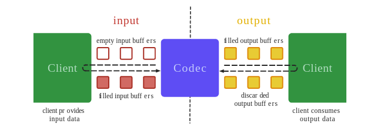

MediaCodec 的模型如下：

MediaCodec作为一个模块， 通过输入队列和输出队列来与外界传递数据。

它的使用方式类似于使用一排电烤箱， 使用的时候，我们找到一个空的，然后填入生的事物，然后再查找熟了的拿出。

MediaCodec 分为编码器和解码器， 编码器输入原始数据输出压缩后的数据， 解码器输入压缩后的数据输出原始数据。

原始数据又分为原始音频数据和原始视频数据， 原始数据和压缩数据都可以使用 ByteBuffer 保存， 但是原始视频数据还可以使用 Surface 来保存， 使用 Surface 效率会更高， 因为 MediaCodec 是本地实现的， Surface 直接使用了本地数据没有复制到 ByteBuffer 的操作。通常不能直接访问 Surface 的数据，但是可以使用 ImageReader 访问 Surface。这样效率也会很高，因为写本地缓冲可以直接映射到 ByteBuffer， 也就是说， ByteBuffer 不用复制本地缓冲到 Java 层， 这是 ByteBuffer 的一种使用模式（直接模式， 使用本地数据）。当使用 ByteBuffer 模式的时候， 还可以使用 Image API 来访问数据（信息量太大了）。

压缩的视频数据，一个缓冲区，一般是一个压缩的视频帧。

压缩的音频数据，一个缓冲区，一般是一个单独的访问单元（也就是一个编码的音频片，通常包含几毫秒的音频数据，至于多少于音频类型有关）。但是也可以包含多个访问单元，这种情况下Buffer的开始和结束都是在访问单元的边界，除非他们标记了 BUFFER_FLAG_PARTIAL_FRAME.

原始音频数据包含 PCM 音频数据， 它是每一个声道的采样数据，每一次的采样按声道的顺序排列为一帧。每一个 PCM 的采样格式要么是16位的符号整数，要么是一个float。编码的时候可以通过configure配置采样数据的格式。可以通过 MediaFormat 获取采样的格式。

原始视频数据的布局格式有几种格式，可以通过 MediaFormat#KEY_COLOR_FORMAT 来确定。 视频编码器可能支持三种类型的格式：

1. CodecCapabilities#COLOR_FormatSurface 可以被用来输入输出 Surface
2. 灵活的 YUV 缓存， 比如 CodecCapabilities#COLOR_FormatYUV420Flexible， 既可以使用Surface访问， 也可以使用 ByteBuffer 模式，使用 Image 访问
3. 其他的， 只支持 ByteBuffer 模式

就这样吧， 今天内容比较无聊，信息量有点大。现在只要有个大的印象就行， 就是那个图， 分为输入输出， 输入一个魂冲队列，输出一个缓冲队列， 对于输入队列，先请求空缓冲，然后填充数据，填充完再放回。对于输出缓冲队列，先请求一个，把数据拿走，然后归还。

明天： 每天一点点音视频_MediaCodec状态转换

