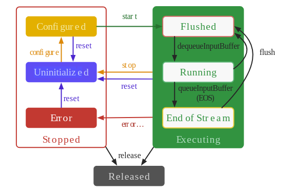

状态， 对于我来说总是比较有兴趣的， 为什么呢？

因为， 状态意味着复杂， 这样说好像我很喜欢复杂一样，但实际上，我只喜欢稍微复杂。我讨厌简单，重复。更准确点， 我喜欢那中对复杂的掌控感， 而如果一个类牵扯到了状态， 它的复杂度就比较大了， 使用状态机， 可以一个复杂的问题空间，分成小的问题空间，再这个问题空间中，它限制了只能进行某些操作，很明确，而且还限制了它只能转向某几个状态。

对于一个状态机， 它的难度编成了，要记住，有哪些状态，状态的转换，再某个状态支持那些操作。

下面， 对 MediaCodec 这个状态机做个说明：

1. 分两个状态组， 停止的 和 执行中的， 两组里的状态，都可以调用 release 进入 释放状态， 进入释放状态后， 这个对象就不能用了， 要想重新使用需要 new 个新的。

2. 一个刚创建的对象，处于未初始化的状态，下一步只能执行 configure， 然后进入配置好的状态，这时候就可以随时开始，进入运行态了。

3. 在除释放状态， 其他状态都可以执行重置，进入为初始化的状态，从而可以重新使用该对象

4. 在运行态停止的话，会进入未初始的状态

5. 在运行态出错的话，会进入错误状态

6. 运行状态包括三个状态： Flushed， Running， End of Stream， （为了明确，就不翻译）

7. 当进入运行态时， 首先是 Flushed， 这时候，还没有往里面输入数据， 当然也没有输出数据， 也就是说输入输出缓冲区都是空的

8. 当在 Flushed 状态， 在填入数据后就进入了 Running 状态

9. 这时候， 可以 一直填入数据， 或者填入结束标志，结束这个流，从而进入 End Of Stream 状态

10. 在 End of Stream， 也就是一个流结束了。

超越设计：

1. 为什么会有个 Released 状态， 它跟 Uninitialized 状态很像， 其他状态都可以转到它们？

    应该是在创建 MediaCodec 对象是分配比较大的数据空间， 为了重复利用， 有了 Uninitialized， 这样在做完一个任务， 如果还有其他的任务，可以重复使用，只需要 reset 以下。而 release 手动释放占用的空间。

2. 既然创建的时候会配置，为什么还需要 configure？

    这还是为了复用， 创建的时候，确定了是解码器还是编码器， 是那种编码器，那种解码器。但是配置的时候是配置数据类型， 和编码器的属性，如果都放在创建的时候配置，那重用的时候就不能改变了编码格式和编码器属性了。

3. 没有 End Of Stream 状态可以吗？

    好像也可以， 但是让我们想一下， 当我们把最后一帧送入 MediaCodec， 它并不知道有没有结束， 如果它的实现机制并不是进去一帧处理一帧，而是满了才会处理，那这时候如果没有满就不会处理了，就需要我们告诉它没有了，不满也要处理。

明天： 每天一点点音视频_MediaCodec创建初始化
