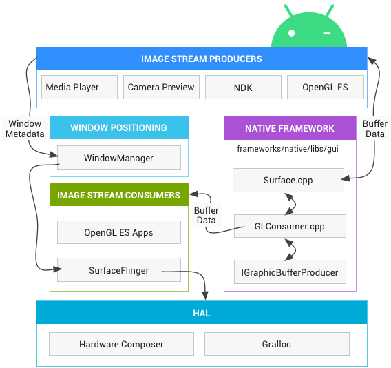

这个系列是讲音视频的，但是这几天会讲 Android 的 Graphics 显示，因为在项目中用到了 Surface， TextureView, SurfaceTexture 这些东西，搞不懂， 所以来学习一下。

内容主要是参考了[官方文档](https://source.android.com/devices/graphics)，是对 Android上图像显示的架构的详细说明。

Android上，应用开发者主要使用三种 API 绘制图形： Canvas， OpenGL ES， Vulkan

无论使用那种 API， 都是绘制到 Surface， Surface 代表了一个缓冲队列的生产者， 消费者是 SurfaceFlinger。Android 上的每一个 Window 后面都有一个 Surface， 所有可见的 Surface 都被 SurfaceFlinger 渲染到显示屏上。

Surface作为一种数据传递的载体， 连通者消费者和生产者， 生产者有很多， 比如 Camera， OpenGL， 解码器。消费者也很多， 比如 SurfaceFlinger， OpenGL， 编码器。

这里的 Image Stream Producers 就是那些能够产生一帧一帧的图像， 可以往 Surface 写入的模块

Image Stream Consumer 就是 Surface 的消费者

Hardware Composer 是硬件抽象层的显示子系统。

Gralloc (graphic memory allocator) 被图形生产者用来分配内存。

以下是我的理解或者是猜测：

Surface 在应用层，代表了底层的一个图形队列， 连接了生产者和消费者。

生产者通过 Gralloc 分配内存， 然后通过绘制 API 向上面绘制，绘制完传出，如果消费者是 SurfaceFlinger， 它就会给 Hardware Composer

明天： 每天一点点音视频_Graphics数据流