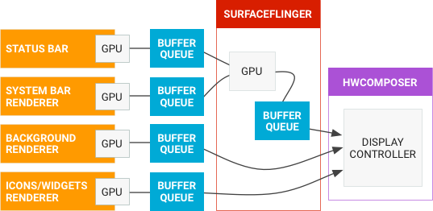
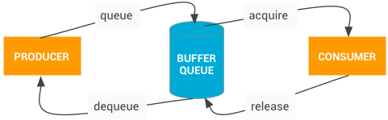

先来个图，看图说话：

现在我才突然明白， 显示屏幕和GPU是两个东西，之前我以为，输入到GPU就是输出到显示屏了，这种错误认知导致了很多纠结的地方。

上图可以看出， 一个正在显示的屏幕， 包括几个部分， 分别对应着一个 Surface， 每个 Surface 后都有一个缓冲队列， 而这其中的某些缓冲队列会经过 GPU 合并成一个缓冲队列， 最后再给 HWCOMPOSER, 这是后才真正在屏幕上显示出来。

SurfaceFlinger 负责排版，对这些不同的部分排列， 昨天的图中可以看到 WindowManager， 就负责提供提供排列的信息。

### BufferQueue

这个模型根 MediaCodec 的模型很相似， 生产者负责获取空的缓存装入数据，再送入， 消费者负责获取由数据的缓冲，使用后再还回去。

它是一个数据结构， 内部是一个缓存池和一个队列， 使用 Binder IPC 再进程间传递数据。生产这的接口是 IGraphicBufferProducer， 它是 SurfaceTexture 的一部分，BufferQueue经常备用来渲染到 Surfacew（这里还是没搞明白， Surface 和 SurfaceTexture， BufferQueue 的关系）

BufferQueue 分三种模式：

1. 类同步模式， 这时，不会丢帧，生产者太快的话会等待空缓存

2. 非阻塞模式， 这时，也不会丢帧，但是生产太快的话，不是等待，而是抛出异常， 这可以避免死锁。

3. 丢弃模式, 这时，如果生产者太快，就会丢掉某些帧

