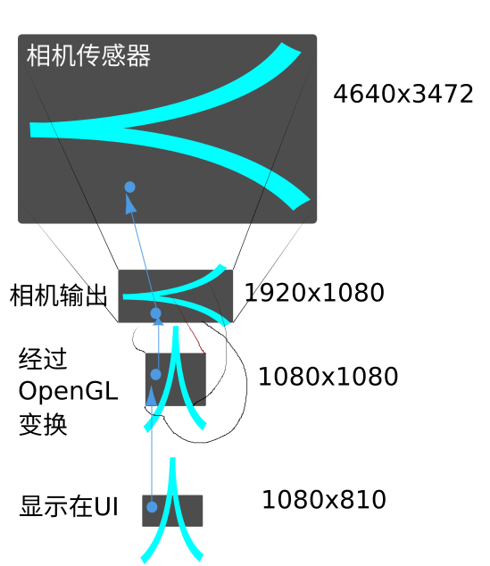

首先来个大大的

# 我草

最近实现相机触摸对焦功能， 用了一周吧， 功能实现2天，剩下的时间调准。

先说为什么条准这么费尽： 因为相机输出到显示画面，经过了多重变换。

然后， 对于屏幕上的一个触摸坐标，最终转换到相机的传感器上的坐标，要经过从下往上的一个逆过程。

我花了大量的时间做这些变换。但是却一直搞错了旋转变换。屏幕坐标转换到传感器坐标的时候需要顺时针转，我却一直做逆时针转。发现这个问题是我写了另一个 Demo 发现的。

为什么，要通过再写个 demo 才发现这个旋转的问题的， 这就是开头的大大的我草的原因所在。

我在代码里传给相机的焦点坐标给传错了，没有传转换后的坐标，而是屏幕上的坐标。这就是无论我怎么改转换的逻辑都没有效果，甚至，而我的打印信息时，打印了转换的函数输入输出，所以从打印信息来看正确。

## 怎么避免这种情况呢

我对这种问题还真没有信心来避免，或者说曾经是。因为在我的印象里，马虎，偶尔的小错误，是无法避免的。为什么说曾经是，因为我觉的我现在犯小错误少了，或者印象里少了，也就是说，犯了可能美在意，没以前那么在以了。

但是，还是要有一种方法论的观念，也就是说，凡事有方法的信念。

1. 小心点。 尽管我知道，这不是小心的问题，肯定是是改来改去的原因，忘了改了哪里，用电路实验的说法，本来想短路了来解决问题，最后出厂了还短路着。

2. 保持头脑清醒。这个也是白扯。清醒并不是想保持就能保持的。还是看自己的做的事情，尽量做少的变动，及时反馈。我有想起了 TDD， 写个失败的测试，通过，重构，循环。让一次循环越小，头脑就会越清醒。

3. 提前把大的问题模型或者叫解决方案搞清楚，写出来，然后找出关键点,先解决关键点。
