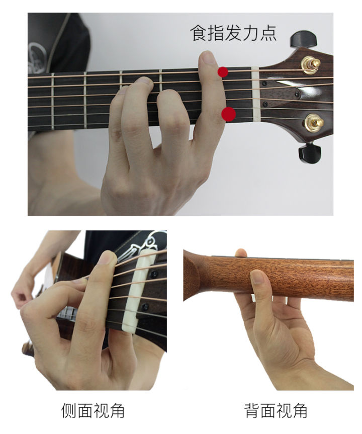

有一天，我突然想明白了自己的矛盾：一边想安定，一边想创业。当时，我只记下了这句话，却没记下为什么，肯定是当时以为明白了，还用记吗？不幸的是，我先在忘记当时怎么想得了。

首先，这种当时觉得很明白，学会了，然后就觉得没必要记录了的想法实在是太具有杀伤力。比如我听了一堂课，那堂课挺难，但是我跟着老师的思路跑，感觉都明白，然后下课了，不去看了，然后，就忘了。比如看了一本书，觉得实在是太有道理了，就是我的想法，然后就不在去看了，然后，就忘了。

说回那个问题， 我现在的理解是这样的：想安定，是因为想在位置上定下来，自己不那么请装上阵了，外物太多了，笔记本，吉他，画板，还有其他很多东西，当然这些都不是根本原因，可能就是年龄到了，也在外面浪了一圈。想创业，首先，我觉的，创业与安定并不矛盾，尽管很多人不这么认为，还有，创业也并不意味这高风险，好吧，可能，这只是我的想法，我是想找个低风险的创业项目。

关于创业项目的选择，我还是一直想着去做一个应用，尽管我知道，创业很广泛，去摆个摊，去开个店，去开个抖音号发视频，但是我就是不想去，就是不想做其它的创业项目，可能也算是思路不开阔，格局打不开吧。

说会这篇文章的主题，我想说说反复。其实这个词经常出现在我的生活中，因为要想掌握一个东西必须要反复。为什么， 一方面，人类会遗忘， 一方面，一遍过去，你的吸收能力有限，就算都吸收了，那也是在你当时的认知上吸收了，比如看完了一遍，如果再看第二遍，第一页的内容，在给予书后面的内容上，会有更多的理解。

这篇文章的主题是反复练习，与高级的说法是刻意练习，带有目标对某一小块的反复练习，像极了初中，高中的专项训练。

在练习吉他的过程中，我发现，刻意练习真的太重要了，大横按，按不好，刻意练习它呀。但是刻意练习比较难，比较让人讨厌，怎么办？这其实是两个两个问题，刻意练习比较难怎么办？刻意练习比较讨厌怎么办？

对于第一个问题可以从两个方面着手解决：

1. 分解成更小的部分
2. 减慢速度

对于第二个问题可以从两方面着手解决：

1. 变着花样来，目标不要变
2. 目标清晰，即使反馈，有评分机制

可能，这些解决方法你早就知道了，又或者太抽象了，无法执行。我下面尝试以练习大横按为例子，提供一些练习方法，希望有所启发。

首先说明一下大横按是什么，大横按是在按吉他和弦时，食指需要按住6根弦的某一品，其他手指再按住某几个弦。具体的例子比如 F 和弦，如图：

这个动作对于初学者来说，需要手上的力量，食指同时按几根弦比按一根弦要用更多的力气。具体的技巧和分析我这里不会讲，只会说明练习策略。

这个动作很难，我们想办法让它简单点。

1. 一下按住要按住的所有弦太难了，那么，我们一下按住一个总会简单点吧。所以，我们保持手形放在相应的位置，但是我们的检测目标不是一次弹响整个 F 和弦，而是只弹一根。
2. 乐器它自带及时反馈，你按对了弦，弹的音自然是对的，这就是一个正反馈
3. 弹完一个音，要放松手形，不然会很容易累。
4. 等基本能按顺序弹弦了，可以打开节拍器，这样又加大了难度，不过增加了反馈，如果感觉比较难，就调慢节拍器，只要感觉难就调慢，感觉熟练了，就再加快点。
5. 这样，增加难度上，一方面，可以提高速度，一方面可以增加手指，另外，因为现在是按的和弦，所以随便按弦，都不会太难听，甚至可以来个即兴solo。这个过程，应该是比较愉悦的。
6. 过程如果愉悦了，就不会停止，就必然能达到目标。
7. 体会，欣赏过程。

这个过程，将一个大的陡坡变成了缓坡。这就是微积分的思想吧。

