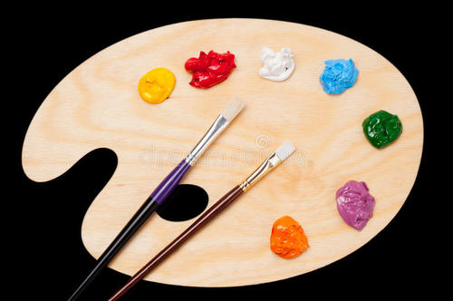

color table 或者叫 palette， 是色盘， 调色板， 类似于现实中的这东西

它会列出所有的图片出现的颜色，对于索引颜色的 BMP，每个像素的值是这个表里的一个索引；对于非索引颜色的 BMP，这个表只是列出出现的颜色，一边设备显示的优化处理。

这里要注意的是， 颜色索引所占的大小可能是 1 位， 4 位， 8 位， 这个数量有点小呀。索引的位图只是适合颜色比较单一的图片。调色板里的颜色的所占大小就是颜色的格式了， RGBA32， RGB24 这个样的。

这块区域的偏移是在 文件头， DIP头 后， 在它之前还可能会有一个可选的区域， 是在压缩算法为 BI_BITFIELDS 时， 有RGB三个通道的颜色掩码。

这块区域的大小，正如 DIP 头里声明的，如果那里声明了数量，这里就是多大，如果声明0，则是 2^n, n 为每个像素的索引所占内存大小。

至此， 就知道了这色盘是什么， 也可以读出这块区域了。

如果要写出兼容行强的应用，还要去看格式的规格书呀。

明天: 每天一点点音视频_bmp_像素数据

