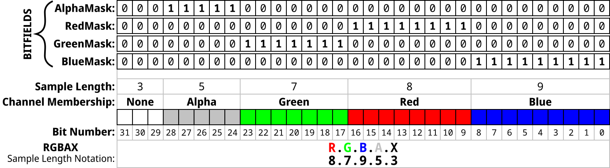

## 像素格式

单位： 每个像素位数（bit per pixel -- bpp）

一般的像素位数为： 1bpp， 2bpp， 4bpp， 8bpp, 16bpp， 24bpp， 32bpp

像素的位数有了，但是具体一个像素的里的位数，各位的含义是什么呢？

首先要知道，一个像素可以包括4个通道，分别是： 红， 绿， 蓝， alpha（透明度）

在 DIB 头里， 提供了特定的字段来定义各通道的掩码，通过掩码来从每个像素数据里选择出几个位作为一个组，被解析成一个通道的数据。

一开始没搞明白，是看了 wiki 最后的例子才搞明白的。

wiki [附上](https://en.wikipedia.org/wiki/BMP_file_format)

## 碎碎念

聊聊理解力， 理解力是对一件事物的看法，认知，它是什么。

当我们看到对一个事物的解释后，我们形成对该事物的新的认知，这个认知是我们对它旧的认知加上现在对它的新的认知。这里面，旧认知会影响新认知， 一个人如果太自负，把自己所已有的认知当作真理，看到新认知时，就不好接受，从而表现为难理解。

这里面的问题是，把一个旧认知当成了真理，一个认知，可能真的是真理，但是真理一定是有前提的，接触新认知时，前提可能与旧认知的前提不同，从而那个真理不适用了。

举例来说， 我对像素格式的理解是来自 Android 里的 Bitmap 和 OpenGL， 那里像素格式有 RGBA8888, RGB565等等。名字就说明了像素的格式， 比如 RGBA8888 的意思是四个通道 红绿蓝透明 按顺序，每个顺序8个位， RGB565 的意思是 三个通道 红绿蓝 按顺序，红占了 5 个位， 绿占了 6 个位， 蓝占了 5 个位。这是我对像素格式的旧认知。

当看 BMP 的这个 WIKI 的时候， 像素格式就与之前的不太一样， 这里引入了一种机制， 使用掩码， 从每个像素中选出特定的通道的位数， 这样通过定义不同的通道， 可以定义上千种像素的格式。不过 WIKI 里也说了， 常用的也就那么几种， 也就是旧认知里的那种。所以新认知对旧认知做了一个底层的解释。

明天： 每天一点点音视频_bmp_实践

