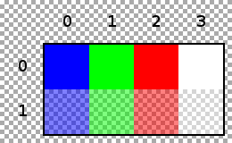

现在依然会有那种错误的冲动，就是学完一个只是以后，就觉得明白了，很简单，这么简单，以后都记住了。然而事实上，这种明白的感觉也没有那么明白，另外，就算当时明白了，以后也会忘，甚至能忘得一干二净。

所以，我也有意识的在学完了一个东西以后，用一下，检测一下。

最近学西的 BMP 格式， 这种只是的检测方式，手写一个读取或者写入 BMP 的程序就很好。

以下是一个 4*2, 每个像素 32 位， 带有透明度的 BMP 的示意图。DIP 头的版本是 BITMAPV4HEADER。

我打算生成一个这样的 BMP 文件,数据都来自 [wiki](https://en.wikipedia.org/wiki/BMP_file_format)

### 第一步确定 DIP 头的版本

使用 BITMAPV4HEADER

### 第二步确定像素格式

使用 32 位， 压缩方法为 BI_BITFIELDS， 使用掩码来确定像素的格式

掩码名称 | 掩码
-|-
红色 | 00 00 FF 00
绿色 | 00 FF 00 00
蓝色 | FF 00 00 00
透明 | 00 00 00 FF

### 第三步确定像素数据

位置 | 颜色数据
-|-
（0,0） | FF0000FF
（0,1） | 00FF00FF
（0,2） | 0000FFFF
（0,3） | FFFFFFFF
（1,0） | FF00007F
（1,1） | 00FF007F
（1,2） | 0000FF7F
（1,3） | FFFFFF7F

### 第四步写入文件头数据

### 第五步写入 DIP 数据

### 第六步写入像素数据

写不完了，以后补 ：）

明天： 每天一点点音视频_MP4_了解

