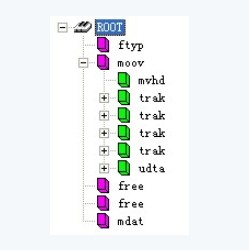
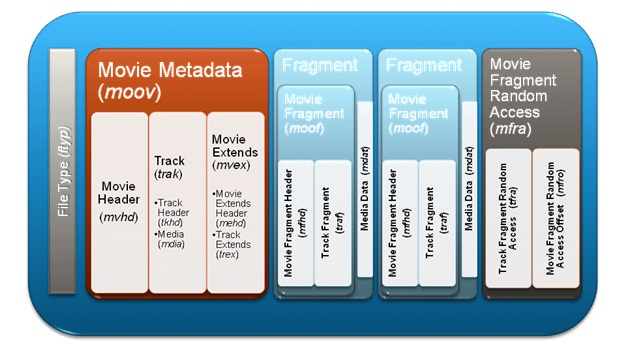

MP4 的标准说明无法看，我就打算参考一下网上别人的文章了，但是刚一看就看到了下面这个图片，萌生了要做么个软件的念头，这个年头是如此强烈，让我忽视掉当前我的处境， 不得不开个新坑。

或者这样子的

写这么个软件，必然对 MP4 文件格式有透彻的了解， 而且一款这种 UI 比较好看的 Android 软件， 必然填补了市场空白。关键我有中感觉，我能把它做完，做好。

风险也是有的

1. 兼容性，可能这种结构兼容性会比较好，没有的结构不显示，不过还是要有个提示
2. 图形的现实可能会比较费劲，不过好像也不太难，就是 View 的嵌套嘛。
3. 要做到对结构的检查，还是需要标准文档的

大的架构是这样的：

1. 每种文件格式有特定的格式，有一层抽象
2. UI 层有一层结构的抽象
3. 实现从文件结构的抽象到现实结构的抽象的转换

额，一不小心就成了所有文件，一开始还是要现实 MP4 文件的结构

已经上传 GIT： [MediaFileStructureViewer](https://github.com/jinguoliang/MediaFileStructureViewer)

明天： 每天一点点_音视频_MP4_概述

