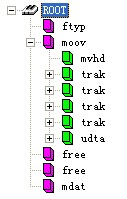

### Box

MP4文件中的所有数据都装在box（QuickTime中为atom）中，也就是说MP4文件由若干个box组成，每个box有类型和长度，可以将box理解为一个数据对象块。

box中可以包含另一个box，这种box称为container box。

一个MP4文件首先会有且只有一个“ftyp”类型的box，作为MP4格式的标志并包含关于文件的一些信息；

之后会有且只有一个“moov”类型的box（Movie Box），它是一种container box，子box包含了媒体的metadata信息

MP4文件的媒体数据包含在“mdat”类型的box（Midia Data Box）中，该类型的box也是container box，可以有多个，也可以没有（当媒体数据全部引用其他文件时），媒体数据的结构由metadata进行描述。

### track

表示一些 sample 的集合， 对于媒体数据来说， track 表示一个视频或音频的序列

### hint track

是个特殊的 track， 不包含媒体数据， 而是包含一些将其他数据 track 打包成流媒体的信息指示

### sample 

对于非 hint track，也就是包含媒体数据的 track， video track 即为一个或者一组视频侦， audio track 为一段连续的压缩音频。 对于 hint track， sample 定义一个或多个流媒体包的格式

### sample table

指明 sample 时序和物理布局的表

### chunk

一个 track 中几个 sample 组成的单元

### 基本的大体结构

---

前段时间我哥住我这工作， 还带来两个孩子， 虽然对原来的习惯有影响，但是基本的习惯都还艰难的保持着。然后他们最近走了，几个坚持的习惯反而崩塌了，奇奇怪怪

明天： 每天一点点_音视频_MP4_BOX

