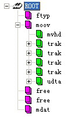

先放一张图：

以下是一些我觉得有启发意义的知识：

1. mp4 里的数据为大端字节序，意味着一个四字节的整数，第一个字节为高位
2. 一个 mp4 文件从头到尾是一个一个的 box 结构
3. 每个 box 的前四个字节为这个 box 的大小， 再四个字节为这个 box 的类型， 这被称为 box 的 header， 剩下的为 body
4. 以上三条就可以遍历文件级别的所有 box
5. 有些 box 中可以有其他的 box，这种包含其他 box 的 box 是容器box
6. 加上这一条，如果知道那个是 容器box 就可以便利所有的 box 了
7. 容器box 包括： moov， trak， mdia 等等

总结：

这个系列的文章主要是了解了 mp4 的 box 的原理，从而可以用软件来查看一个 mp4 文件的所有 box，至于具体的 box 的数据结构，我打算在应用里面详细的描述出来。

项目地址： [https://github.com/jinguoliang/MediaFileStructureViewer](https://github.com/jinguoliang/MediaFileStructureViewer)

明天： 每天一点点_音视频_OpenGL_概述

